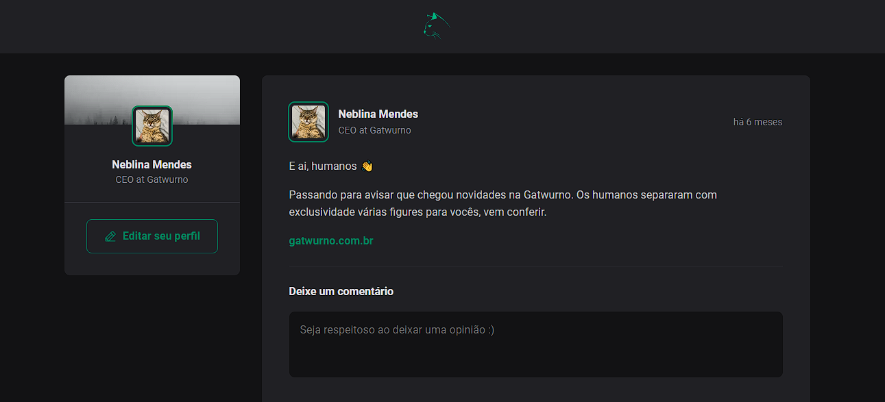

<h1 align="center"> Cat Feed </h1>

  

## 🚀 Tecnologias

Esse projeto foi desenvolvido com as seguintes tecnologias:

- HTML e CSS
- Typescript
- Git e Github
- Figma

## 💻 Projeto

Cat Feed é uma linha do tempo simples de uma rede social utilizando typescript. 

- [Acesse o projeto finalizado, online](https://)

